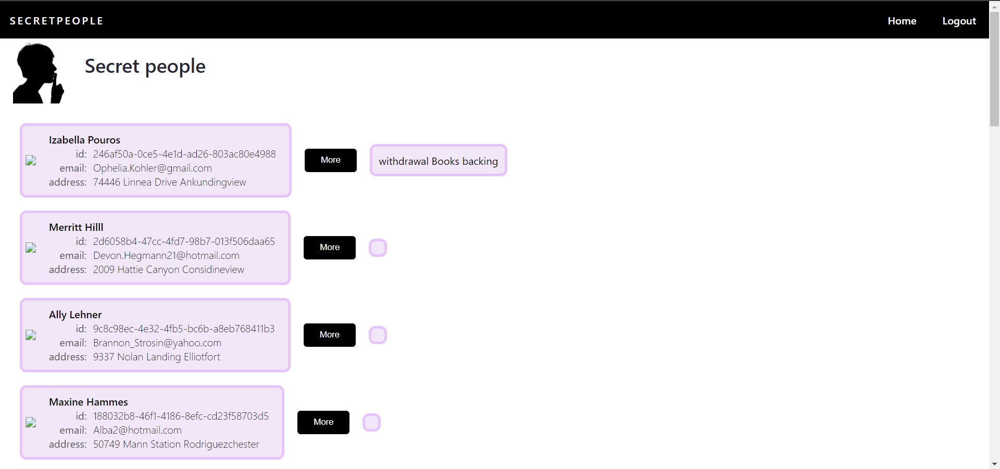

# :lock: Secret People

## :scroll: About the project

A web-page that shows a list of secret peopple after registration

## :cd: Running the project

- start the server from [here](https://github.com/nekitboy/JS-beginer-course/tree/react-ecosystem-homework)
- start the client with `npm start`

The application will open in your browser.

## :desktop_computer: Functionality

Registration page. Allows user to register, shows errors from the server. After successful registration, redirects to sign-in page.

Sign-in page. Allows registered user to sign in, shows errors from the server. After successful signing in, redirects to main page.

 

Main page before and after authorization.

 

To see the list of secret people, the user should go to the 'Home' page. To see the description, tap the 'More' button.

